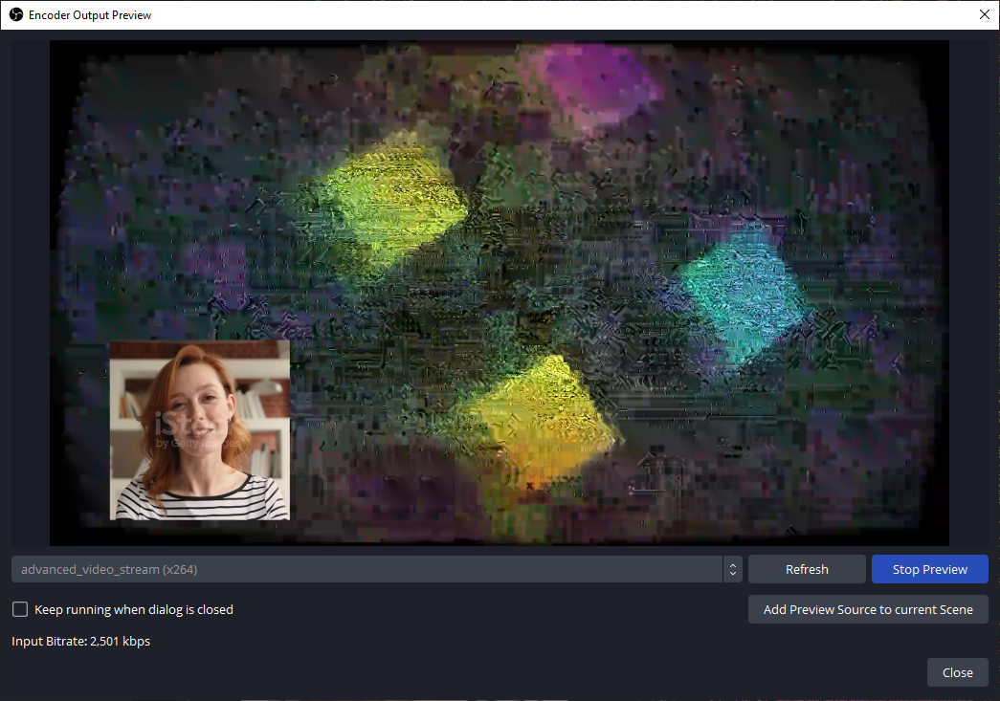

# OBS ROI / Encoder Output Preview
#### A plugin for encoding nerds.

This plugin adds two new features to OBS, accessible via the "Tools" menu:
1. Region of Interest Editor
2. Encoder Output Preview

## Region of Interest Editor

The ROI editor makes it possible to specify regions for the encoder to (de-)prioritise.

### Features

- Per-Scene configuration
- Scene Item Region
    + Follows a scene item
- Manual Region
    + Manual size and position
- "Center Focus" region
    + Adds rectangular or radial ROI to center of screen, ideal for first-person games

### Encoder Support

- NVIDIA NVENC
- AMD AMF
- Intel QSV
- x264

## Encoder Output Preview

The Encoder Output Preview makes it easily possible to check encoder settings without having to start a stream or recording.  
This makes it the ideal companion to the ROI Editor, as the effect of changes on the encoded output can be observed in near real-time.

### Features

- Preview recording and streaming encoders, regardless of whether the outputs are active
- Preview Source can be added to scenes, allowing it to be accessible via multiview and OBS projectors
- Compatible with H.264, AV1, and HEVC
